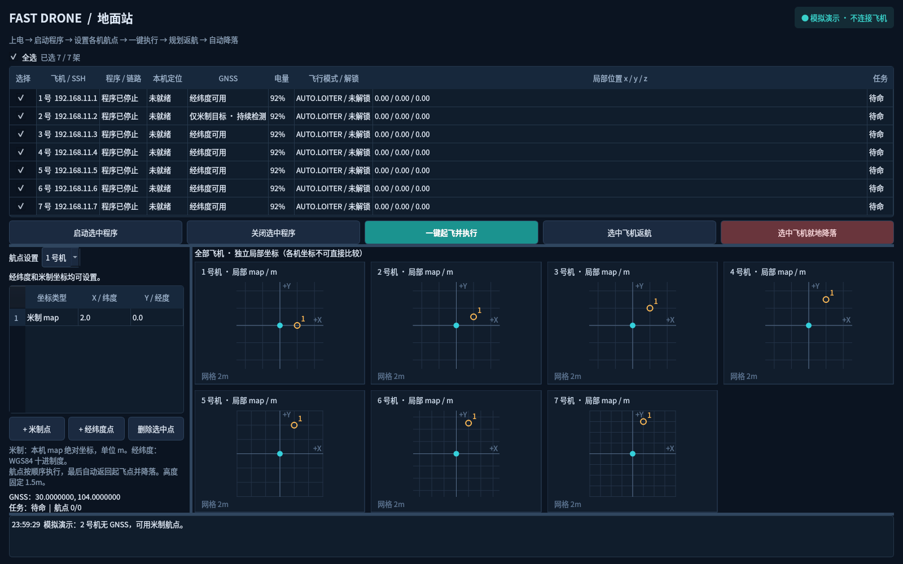

# ego-ground-station

PyQt5 地面站，管理 1～7 号机。每架独立运行 Fast-Drone-250，通过已有 EGO 规划器导航、返回起飞点，再自动降落；不建立机间通信或共同坐标系。

## 启动

```bash
cd /home/nanwan/ego_hjj/ego-ground-station
bash run.sh
```

离线演示：`bash run.sh --demo`，不连接真实飞机。依赖为 `requirements.txt` 中的 PyQt5、Paramiko，本机已经具备。

`config.example.json` 提供七架机的地址和用户名，不含密码。首次启动会据此生成 `config.local.json`，在本地填写 SSH 凭据。已有本地配置保留航点；本次部署已加入 4～7 号机。本地配置、日志、缓存均被 Git 忽略。

| 飞机 | SSH 地址 | 用户 |
|---|---|---|
| 1 | 192.168.11.1 | icaa |
| 2 | 192.168.11.2 | icaa01 |
| 3 | 192.168.11.3 | pc |
| 4 | 192.168.11.4 | icaa |
| 5 | 192.168.11.5 | pc |
| 6 | 192.168.11.6 | icaa |
| 7 | 192.168.11.7 | icaa |

## 使用流程

1. 飞机上电并启动机载电脑，地面电脑接入相应网络。
2. 勾选飞机，点击「启动选中程序」。启动 Docker 中的传感器、MAVROS、规划器及观测代理，不解锁、不起飞。
3. 等待状态就绪，选择每架飞机并设置自己的航点。
4. 点击「一键起飞并执行」并确认。机上检查本机定位等条件，确认 OFFBOARD 后请求解锁，起飞稳定后按航点顺序导航，最后规划返回起飞点并自动降落。
5. 可提前点击「返航」或「就地降落」。切换为外部控制模式后不自动抢回 OFFBOARD。
6. 已着陆、未解锁且没有执行中任务时，可以关闭机上程序。

选择列只保留居中勾选框；上方「全选」支持全选、取消全选，并显示部分选中状态。七架飞机的独立坐标图同时显示，随窗口宽度自动换列；空间不足时可滚动查看。拖动分隔条可调整状态表、航点/地图区及日志的大小。

GNSS 和坐标参考持续检测，正常通信下约每 0.7 秒查询一次机上状态；参考有效后自动启用「+ 经纬度点」，无需重启。失效或遥测超过 3 秒未更新时禁用经纬度点，恢复后自动启用，米制点仍可设置。坐标转换参考需要在未解锁、静止时取得稳定的 GNSS、本机定位及罗盘数据。

批量操作为独立并发请求，不保证同时离地或全部接受。任务在机上执行，地面站断开后已接受任务仍继续；重新连接仅查询进度，不重发起飞。

## 坐标与参数

米制航点是该机 MAVROS `map` 的绝对 x/y，单位米，不是相对位移。经纬度采用 WGS84 十进制度，界面先纬度、后经度，数据来自旧系统同样使用的 `/mavros/global_position/global`。

无有效 GNSS/地理参考时，经纬度输入不可用，**米制任务仍可执行**，但本机定位和飞控检查必须通过。经纬度转换采用每机自身的同步局部位置、GNSS 和罗盘参考，不使用公共原点。不同飞机的局部坐标不能直接比较。

- 目标高度 1.5m，保持初始 yaw；2D Nav Goal 模式。
- 最大速度 2m/s、最大加速度 6m/s²；重规划时间阈值 0.2s。
- 地图分辨率 0.1m，水平膨胀 1.3m，地图 z 边界 [1.3,1.7]m。
- 航点接受范围 |x|<48.7m、|y|<23.7m，为现有地图边缘保留余量。
- 起飞点 |z|>0.15m 时拒绝任务，避免相对起飞高度与规划器固定绝对高度不一致。

## 部署与验证

机上目录：`/home/<用户名>/Fast-Drone-250`；容器：`fast-drone-250`。旧 swarm 服务已停用，新容器不自动运行飞行任务。观测代理由界面启动，源码来自本仓库 `onboard/`。

[4～7 号机部署记录](docs/aircraft-4-7-deployment.md)包含复用的雷达配置及静态验证结果。飞控连接、定位和点云就绪不等于完成实机飞行验收；本次未发送真实解锁、起飞或导航目标。


